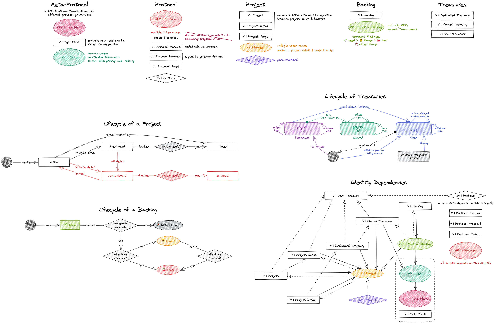

# :warning: [Beta] Kreate Protocol :construction:



We currently maintain the [Kreate protocol specifications on Notion](https://shinka-network.notion.site/Kreate-Protocol-ae97c4c66db447278ea8da9cd7b860a2).

This repository contains the implementation in Gen I. It is currently at the Beta stage for mainnet testing.

## Getting Started

### Installing

```
npm i
```

### Running the Scripts

#### Bootstrap protocol

```sh
export BLOCKFROST_URL=https://cardano-[preview/preprod/mainnet].blockfrost.io/api/v0
export BLOCKFROST_PROJECT_ID=preview***********************
export NETWORK=Preview
export TEST_SEED_PHRASE_URL=xxxxx%20xxxxxxx%20xxxxxxxx%20xxxxxxx
export STAKING_MANAGER_ADDRESS=addr_xxxxxxxxxxxxxxx
export POOL_ID=poolxxxxxxxxxxxxxxxxxxxxxxx
```

```
npm run deploy
```

#### Propose minting rules

1. Update information in `src/cli/meta-protocol/propose.ts` and `src/cli/meta-protocol/apply.ts` then propose:

```
npm run meta-protocol:propose
```

2. Wait for the proposal duration before applying:

```
npm run meta-protocol:apply
```

#### Emulator Test

```
npm test
```
